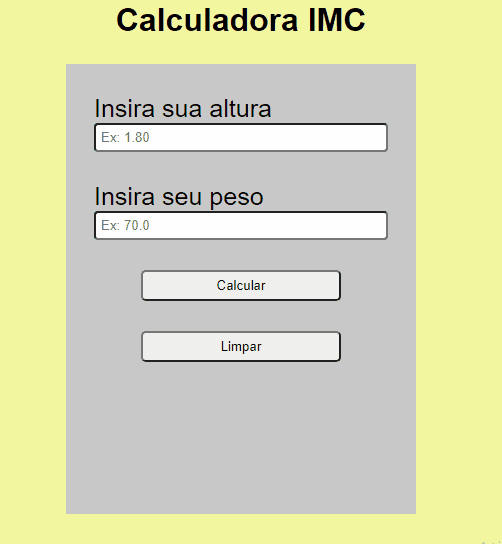

# Calculadora-IMC

Esse é um site que calcula seu índice de massa corporal💪💪

<ul>
  <li>Primeiro você coloca a sua altura conforme o exemplo.</li>
  <li>Logo depois você coloca o seu peso conforme o exemplo.</li>
  <li>Agora é só apertar em calcular e você terá o seu IMC.</li>
</ul>

## Como é feita a classificação

  - Se o seu IMC for menor que 18.5, o resultado será Magreza. 
  - Se o seu IMC for maior ou igual a 18.5 e menor que 25, o resultado será Normal. 
  - Se o seu IMC for maior ou igual a 25 e menor que 30, o resultado será Sobrepeso. 
  - Se o seu IMC for maior ou igual a 30 e menor que 40, o resultado será Obesidade. 
  - Se o seu IMC for maior que 40, o resultado será Obesidade Grave.

